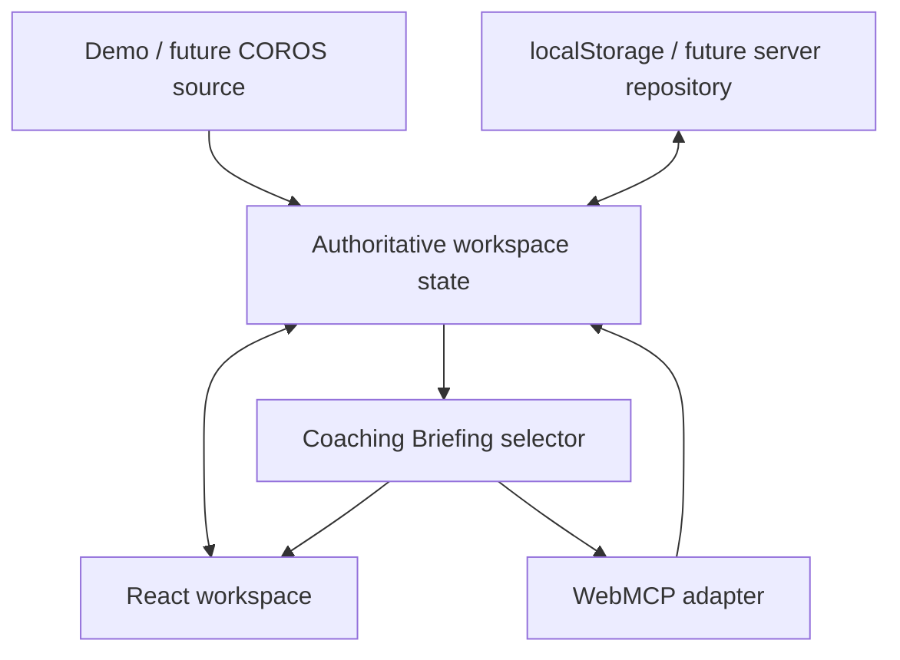

# Implementation and verification architecture

Status: Accepted target for the WebMCP Challenge proof of concept

Architecture version: `1.2`

Fixture contract: [`demo-athlete-v1`](demo-athlete-coaching-contract-v1.md)

This document defines the module boundaries, state ownership, adapter seams, deterministic lifecycle, verification layers, and release evidence for the Shared Coaching Workspace. It is an architecture decision artifact, not a production implementation specification.

## Goals

- Keep the proof of concept small enough to deliver before the Challenge deadline.
- Ensure the Athlete and Coach Agent read and mutate one authoritative Training Plan.
- Give a fresh Coach Agent a bounded Coaching Briefing without relying on prior conversation history.
- Isolate emerging WebMCP host behaviour from ordinary application logic.
- Make Plan Approval explicit, previewable, atomic, and idempotent.
- Preserve a direct transition from synthetic data to a bespoke Brighton 2027 product.
- Produce verifiable evidence for the exact public release build.

## Delivery cut order

Architecture preserves the future product; hackathon acceptance is tiered.

### Must ship

- the shared Week experience and accepted fixture;
- Athlete-visible workout/health evidence and Coach-Agent-readable context;
- one seeded Athlete Profile, one active Coaching Topic, and one shared Coaching Briefing projection;
- Athlete Feedback;
- one host-verified review mode;
- two ranked Workout Adaptations, calendar preview, explicit Plan Approval, and visible update;
- deterministic reset, happy-path browser persistence, and an honest lightweight memory-only fallback;
- focused domain/contract tests, one complete Playwright hero flow plus critical non-mutation/reset coverage;
- public deployment and real-host smoke evidence.

Ticket 1's Month view and simple storage fallback remain in scope because implementation began before this cut order.

### Strengthen if time

- the alternate review-delivery mode only if it is separately reverified and does not endanger the accepted fallback;
- broader Demo Guide and debugging affordances;
- additional responsive/accessibility refinement beyond the polished baseline;
- extra lifecycle end-to-end flows and exhaustive storage failure cases;
- richer Adaptation History presentation beyond the applied receipt required by the judge flow.

### Post-hackathon

Real COROS hydration, server persistence, full Training Plan generation, Phase Transition, rich audit history, and broader integrations belong to the [post-hackathon product roadmap](post-hackathon-product-roadmap.md). The ports remain; speculative infrastructure does not.

## System shape



The application is a client-only React, TypeScript, and Vite SPA. The application core is framework-independent and exposes ordinary typed commands and queries. UI and adapters depend on the application core; the core does not depend on React, WebMCP, browser storage, or a hosting provider.

## Source modules

```text
src/
  domain/          Coaching types, value objects and invariants
  demo/            demo-athlete-v1 fixture and validation
  application/     Workspace reducer, commands, selectors and review state machine
  adapters/
    persistence/   Browser storage implementation
    webmcp/        Tool schemas, registration, execution and cleanup
  ui/              React views and components
  main.tsx          Composition root
```

### `domain`

Owns the canonical application vocabulary and data structures for Athlete, Athlete Profile, Target Race, Training Plan, Planned Workout, Workout Result, Athlete Feedback, Coaching Topic, Coaching Briefing, Coach Recommendation, Workout Adaptation, Plan Approval, Adaptation History, plan versions, and idempotency receipts.

It contains no browser, storage, framework, WebMCP, or fixture code.

### `demo`

Owns the immutable `demo-athlete-v1` seed, fixed clock, source-labelled Athlete Profile, one active Coaching Topic, synthetic observations, and runtime fixture validation. It may create the initial `WorkspaceState`, but it does not own subsequent mutations.

### `application`

Owns:

- the pure workspace reducer;
- typed commands and queries;
- selectors used by both UI and WebMCP reads, including the bounded Coaching Briefing;
- validation of Plan Approval and Workout Changes;
- plan-version and idempotency checks;
- the transient review state machine;
- structured application outcomes.

React components and WebMCP callbacks never edit Training Plan objects directly.

### `adapters/persistence`

Implements `WorkspaceRepository` for browser-local storage. It loads, validates, saves, clears, and reports durability. It catches unavailable-storage and quota failures and supports the accepted in-memory fallback.

### `adapters/webmcp`

Owns only host mechanics:

- capability detection;
- tool names, descriptions, JSON input schemas, and annotations;
- an explicit `primary` or `fallback` review mode;
- registration after successful application initialization;
- translation between tool payloads and typed application commands/queries;
- `AbortSignal`, unload, cleanup, and single-settlement behaviour;
- the stored two-call fallback delivery;
- structured safe errors.

It does not generate Coach Recommendations, interpret Athlete evidence, or mutate the Training Plan independently.

The codebase owns a seven-tool contract, but a host never sees both review paths. In `primary` mode it registers the three read tools, Athlete Feedback, and `review_workout_adaptation`. In `fallback` mode it registers the three reads, Athlete Feedback, `open_workout_adaptation_review`, and `read_workout_adaptation_decision`.

### `ui`

Renders the weekly and monthly Training Plan views, workout detail, the bounded Athlete Profile and active Coaching Topics, shared evidence, Athlete Feedback, temporary review modal, calendar preview, Adaptation History, Demo Guide, WebMCP connection status, persistence warnings, and reset flow.

Presentation components consume selectors and dispatch application commands. Component-local state is limited to non-authoritative presentation concerns.

### `main.tsx`

Acts as the composition root. It loads the repository, validates or restores the fixture, constructs the application and review coordinator, mounts React, registers WebMCP tools, and owns top-level cleanup.

## Product-transition ports

Two deliberately small interfaces isolate the POC implementations:

```ts
interface CoachingContextSource {
  loadContext(): Promise<CoachingContext>;
}

interface WorkspaceRepository {
  load(): Promise<PersistedWorkspace | null>;
  save(workspace: PersistedWorkspace): Promise<Durability>;
  clear(): Promise<void>;
}
```

For the POC:

- `CoachingContextSource` reads `demo-athlete-v1`;
- `WorkspaceRepository` uses `localStorage`.

For the future product:

- a separate scheduled process can query COROS MCP and hydrate a normalized context source;
- a server-backed repository can persist Athlete Profile, Coaching Evidence, Coaching Topics, Training Plan, Athlete Feedback, and Adaptation History.

Current COROS MCP data remains read-only for this POC. The application does not claim COROS wire-format compatibility. Future authenticated schemas map through an adapter rather than replacing the domain model.

## Authoritative state

One reducer-owned serializable `WorkspaceState` is authoritative for Athlete-visible and Coach-Agent-readable domain state:

```ts
type WorkspaceState = {
  athlete: Athlete;
  athleteProfile: AthleteProfile;
  targetRace: TargetRace;
  trainingPhase: TrainingPhase;
  observations: SyntheticCorosShapedSnapshot;
  workoutResults: WorkoutResult[];
  trainingPlan: {
    planVersion: number;
    plannedWorkouts: PlannedWorkout[];
  };
  athleteFeedback: AthleteFeedback[];
  coachingTopics: CoachingTopic[];
  processedRequestIds: string[];
  appliedReviewIds: string[];
  adaptationReceipts: AdaptationReceipt[];
};
```

The persisted envelope contains the complete serializable snapshot:

```ts
type PersistedWorkspace = {
  schemaVersion: 2;
  seedVersion: "demo-athlete-v1";
  savedAt: string;
  state: WorkspaceState;
  undeliveredFallbackResult?: AdaptationDecision;
};
```

All human views and WebMCP reads use selectors over the same state instance. No independently cached Training Plan, UI-only profile, Agent memory blob, or prose summary is authoritative.

## Coaching Briefing projection

The application owns a deterministic selector that assembles the context a fresh Coach Agent needs for the current judging interaction. It contains:

- identity, Target Race, and current Training Phase;
- the small Athlete Profile fields that can affect the decision;
- the current health and load snapshot with freshness and provenance;
- active Coaching Topics with status, timestamps, evidence references, and follow-up conditions; and
- recent Adaptation History when present.

The selector is bounded by contract rather than token count. It does not copy every Workout Result or conversation into one payload; `get_training_plan` and `get_workout_context` remain the deeper evidence reads. The UI renders the same projection so the Athlete can inspect what the Coach Agent is expected to know.

For `demo-athlete-v1`, the selector always returns the seeded profile and shin-discomfort topic. Relevance is expressed by the topic's follow-up condition. The Coach Agent may acknowledge the topic when the Athlete reports on a run, but cannot diagnose, silently resolve, or allow it to override stronger current evidence.

## Transient review state

The active review is a separate in-memory state machine because Promise resolvers, abort listeners, registration handles, selection, and preview cannot meaningfully survive reload:

```text
idle -> reviewing -> applied | discuss_further | cancelled
```

The review coordinator exclusively owns:

- the active `reviewId`;
- the proposal and expected `planVersion`;
- the selected option and derived preview;
- the primary tool Promise resolver;
- abort and unload cleanup;
- exactly-once terminal settlement.

An unfinished primary review is cancelled on reload, unload, reset, or host abort. A compatibility-fallback review applies through the same application command; only its completed, undelivered terminal result persists for later delivery.

## Planned Workout and Workout Result

Planned intent and recorded outcome are separate but comparable.

```ts
type PlannedWorkout = {
  id: string;
  date: string;
  type: WorkoutType;
  title: string;
  purpose: string;
  distanceKm: number;
  prescription: {
    blocks: WorkoutBlock[];
  };
};

type WorkoutResult = {
  id: string;
  plannedWorkoutId?: string;
  startedAt: string;
  status: "completed" | "partial" | "stopped";
  summary: WorkoutSummary;
  laps: WorkoutLap[];
};
```

Planned Workout blocks express intent. Workout Result laps express device-recorded performance. Both use explicit units. A lap may reference a planned block only when the correspondence is reliable; adaptation never rewrites completed history.

The Workout Result model is conceptually COROS-shaped—activity summary plus laps—but remains an internal canonical structure because public COROS documentation does not publish exact response schemas.

## Workout Changes

Workout Adaptations contain validated CRUD mutations:

```ts
type WorkoutChange =
  | { kind: "create"; workout: PlannedWorkoutDraft }
  | {
      kind: "update";
      workoutId: string;
      changes: {
        date?: string;
        title?: string;
        purpose?: string;
        distanceKm?: number;
        prescription?: WorkoutPrescription;
      };
    }
  | { kind: "delete"; workoutId: string };
```

Read operations remain in `get_training_plan` and `get_workout_context`. IDs are immutable. Distance and a replacement prescription are validated independently; focused fixture tests prove that supplied pairs carry the accepted coherent values without deriving distance from arbitrary Workout Blocks. A nested prescription is replaced as one complete validated value; arbitrary JSON Patch paths are not accepted. Deleting the only Planned Workout on a date leaves that date as rest. The applied receipt records cited evidence, rationale, selected option, affected workouts, application time, and plan versions before and after so it can serve as bounded Adaptation History.

Every proposed option records the `planVersion` on which it was based. A mismatch returns `stale_plan` without applying or merging changes.

## Review proposal interface

The tool input encodes ranking structurally rather than asking the Coach Agent to coordinate array order, ranks, and roles:

```ts
type ReviewProposal = {
  reviewId: string;
  sourceWorkoutId: string;
  expectedPlanVersion: number;
  evidenceRefs: string[];
  rationale: {
    summary: string;
    counterEvidence: string;
    confidence: "low" | "moderate" | "high";
    limitations: string[];
  };
  recommended: AdaptationOption;
  alternative: AdaptationOption;
};
```

`get_training_plan` makes `planVersion` and stable Planned Workout IDs prominent. Context reads expose reusable evidence references. Validation errors identify the rejected field and expected correction so the Agent can retry without reconstructing the proposal blindly.

## Plan Approval transaction

Only the Athlete pressing **Adapt my plan** authorizes mutation. The selected option already contains the exact changes shown in the preview.

The application command:

1. verifies the active review, unused `reviewId`, current `planVersion`, and valid selected option;
2. validates every Workout Change against the current Training Plan;
3. produces the entire next Training Plan or rejects without mutation;
4. increments `planVersion`;
5. records the `reviewId` and complete Adaptation History receipt atomically in state;
6. attempts to persist the complete resulting snapshot;
7. produces the terminal result for the pending primary call or stored fallback delivery.

The primary and fallback paths invoke the same command. If browser persistence fails, the in-memory application remains authoritative for the current page, the terminal result includes `durability: "memory_only"`, and the UI warns that reload will lose the changes.

Repeated `reviewId` or `requestId` values return their existing outcome and cannot apply or record twice.

## Initialization, connection and reset

Initialization order:

1. Load the persisted envelope.
2. Validate schema, seed version, and domain invariants.
3. Restore `demo-athlete-v1` when state is missing, invalid, or unsupported.
4. Construct the application core and review coordinator.
5. Mount the Shared Coaching Workspace.
6. Register exactly one active review-mode tool set when `document.modelContext` is available; never expose primary and fallback review tools together.
7. Publish `connected`, `unavailable`, or `error` status to the UI.

An invalid saved snapshot is replaced rather than heuristically repaired. The UI shows a restrained notice that demo state was refreshed. A migration switch remains available when a second schema version actually exists.

**Reset demo** uses a lightweight in-page confirmation. Approval of reset:

- cancels an active review with reason `reset`;
- clears the persisted envelope and undelivered fallback result;
- clears new Athlete Feedback, topic updates, plan changes, idempotency records, receipts, selection, and preview;
- restores the exact seeded Athlete Profile, Coaching Topic, fixed clock, and initial `planVersion`;
- leaves browser capability detection and tool definitions available.

## Structured outcomes

Expected tool and application failures return safe structured outcomes rather than raw exceptions or stack traces:

```ts
type ApplicationError = {
  status: "error";
  code:
    | "invalid_input"
    | "not_found"
    | "busy"
    | "stale_plan"
    | "cancelled"
    | "storage_unavailable";
  message: string;
  retryable: boolean;
};
```

Unknown programming faults are logged locally in development and converted to a generic non-sensitive failure at the WebMCP boundary.

## Demo Guide and integration status

Week and Month remain the primary Training Plan views. A restrained persistent header badge displays WebMCP state. Activating it opens a Demo Guide utility drawer or tab containing:

- the synthetic scenario and provenance label;
- a suggested ChatGPT prompt;
- connection state and registered tool names;
- the latest tool outcome;
- browser-enablement guidance;
- Reset demo.

This information is subordinate to the coaching experience. The full human workspace remains usable when WebMCP is unavailable.

## Automated verification

Every release candidate must pass the highest practical behavior seams:

1. TypeScript type-check.
2. Production Vite build.
3. Focused Vitest domain/application coverage for fixture and profile/topic validation, Coaching Briefing selection, Workout Changes, atomicity, plan-version rejection, Athlete Feedback/review idempotency, Adaptation History, preview-before-mutation, selected review-mode settlement, and deterministic reset.
4. Focused adapter coverage for persistence migration or reset, happy path and lightweight memory-only fallback, active-mode tool registration and descriptions, structured results/errors, absent WebMCP behavior, and cleanup.
5. Playwright for one complete hero flow plus critical reset and non-mutation behavior.

Additional lifecycle combinations, storage quota permutations, and duplicate end-to-end flows strengthen the release when time permits; they are not allowed to delay a working, manually verified hero flow. Automated tests use a controllable host harness. Real ChatGPT attachment and timeout behavior remains manual evidence.

## CI and deployment

GitHub Actions uses a pinned supported Node version and committed lockfile. The required workflow runs install, type-check, Vitest, production build, and Playwright. Vercel supplies preview deployments for review and a public top-level HTTPS production deployment.

Version-controlled deployment configuration must provide `Origin-Agent-Cluster: ?1`. The normal human interface must not require `document.modelContext`. Production promotion occurs only from a commit that passed the automated gate.

## Manual host release gate

The exact production URL and release commit require headed smoke testing in:

- enabled Chrome 149+ through the Model Context Tool Inspector;
- ChatGPT's in-app browser with the deployed Shared Coaching Workspace attached.

The checklist verifies:

- discovery of the configured six-tool fallback surface;
- shared Coaching Briefing, Training Plan, Workout Result, and health/load reads;
- visible and WebMCP-readable Athlete Profile and active Coaching Topic;
- Athlete Feedback recording;
- the open/read fallback review through Plan Approval;
- preview-before-mutation and visible calendar updates;
- the stored compatibility fallback;
- cancellation, stale/duplicate protection, reload, and reset;
- consistent evidence for the Athlete and Coach Agent;
- accurate behaviour when WebMCP is unavailable.

The released fallback flow has been verified in enabled Chrome and ChatGPT hosts. Any release that changes the context schema, selectors, tool descriptions, or judging path must repeat the exact fresh-conversation host checks against the deployed commit.

For the context-aware release, record at least three clean fresh-conversation trials, including the deployed commit, host, model, observed tool trace, outcome, and any corrective prompting. A corrected second attempt does not count as first-pass success.

## Acceptance evidence

A version-controlled release checklist records:

- release commit SHA;
- production deployment URL;
- automated commands and results;
- Chrome and ChatGPT versions;
- tester and UTC timestamp;
- each manual scenario result;
- each fresh-conversation context trial and tool trace;
- known limitations.

The README links to this checklist and identifies the exact judge flow. The public video, Devpost entry, tested commit, and production deployment must describe the same release. The tested release is frozen for judging after submission.

## Scope boundary

This architecture does not implement real COROS authentication or synchronization, a scheduled hydration process, server persistence, conversational Athlete Profile building, general-purpose Agent memory, accounts, full plan generation, Phase Transition logic, injury diagnosis, multiple Athletes, or in-app chat. The ports make later replacement possible; they do not expand the POC.
